# 🚀 My Download Manager - Ultimate Final Edition

<div align="center">


# ⚡ My Download Manager (MDM)

### *Accelerate Your Downloads by Up to 8x Faster!*

[](https://github.com/kezoooop/MyDownloadManager)
[](https://github.com/kezoooop/MyDownloadManager)
[](https://github.com/kezoooop/MyDownloadManager)
[](https://github.com/kezoooop/MyDownloadManager)

</div>

---

<div align="center">
  
### 🌟 **The Ultimate Download Manager for Windows** 🌟

**Stop waiting for downloads - Start accelerating!**

</div>

---

## 🌐 Official Website | الموقع الرسمي

<div align="center">

### 🔗 **[https://mydownloadmanager.pages.dev/](https://mydownloadmanager.pages.dev/)**

**Download the latest version, get support, and stay updated!**  
**تحميل أحدث إصدار، احصل على الدعم، وابق على اطلاع!**

📧 **Email | البريد الإلكتروني:** **kamel.buisness@outlook.com**

</div>

---

## 📖 Table of Contents | فهرس المحتويات

- [✨ Introduction](#-introduction)
- [🔥 Key Features](#-key-features)
- [📸 Application Showcase](#-application-showcase)
- [🚀 Installation Guide](#-installation-guide)
- [🎯 How to Use](#-how-to-use)
- [🌐 Browser Extension Installation](#-browser-extension-installation)
- [💡 Pro Tips](#-pro-tips)
- [🛠️ Troubleshooting](#️-troubleshooting)
- [📱 Connect With Us](#-connect-with-us)
- [النسخة العربية](#النسخة-العربية)

---

## ✨ Introduction

<div align="center">

### **Welcome to the Future of Downloading**

</div>

**My Download Manager (MDM)** is a next-generation download accelerator that revolutionizes how you download files and videos from the internet. Built with cutting-edge technology, MDM combines blazing-fast speeds with intelligent features that make downloading effortless.

### Why MDM Stands Out:

| Feature | Benefit |
|---------|---------|
| ⚡ **8x Faster Speeds** | Download large files in minutes, not hours |
| 🎯 **Universal Support** | Works with ALL websites and file types |
| 🔄 **Smart Resume** | Never lose your progress - resume from where you stopped |
| 🎬 **4K Video Support** | Download high-quality videos from social media |
| 📋 **One-Click Browser Integration** | Capture downloads directly from your browser |
| ⏰ **Smart Scheduling** | Automate downloads at specific times |
| 🔐 **File Integrity Verification** | Ensure your downloads are 100% intact |

---

## 🔥 Key Features

<div align="center">

| Feature | Description | Icon |
|---------|-------------|------|
| **Video Download** | YouTube, TikTok, Instagram, Facebook, Twitter/X, Pinterest, Vimeo, Dailymotion, Twitch, and more | 🎬 |
| **File Download** | All file types: documents, archives, executables, images, audio | 📄 |
| **4K Quality** | Up to 4K (2160p), 2K (1440p), 1080p, 720p, 480p, 360p | 🎥 |
| **Playlist Support** | Download entire YouTube playlists with video selection | 📋 |
| **Browser Integration** | Capture downloads directly from your browser | 🌐 |
| **Clipboard Capture** | Auto-detect copied links and start downloads instantly | 📋 |
| **Pause & Resume** | Pause and resume downloads at any time | ⏸️ |
| **Speed Control** | Global and per-download speed limits | ⚡ |
| **Queue Manager** | Manage multiple downloads efficiently | 📊 |
| **Advanced Scheduler** | Schedule downloads at specific times | ⏰ |
| **Hash Verification** | Verify file integrity with SHA-256 | 🔐 |
| **Smart Folders** | Auto-organize downloads by source and type | 📁 |
| **Proxy Support** | HTTP, SOCKS4, SOCKS5 proxy support | 🌍 |
| **Bandwidth Quota** | Set daily/weekly download limits | 📊 |
| **Auto Shutdown** | Shutdown, sleep, or hibernate after downloads complete | 🔌 |
| **Sound Alerts** | Audio notifications for download events | 🎵 |
| **Portable Mode** | Carry your settings anywhere | 💼 |

</div>

---

## 📸 Application Showcase

### 🖥️ Main Interface

<div align="center">
  
  <br>
  <em>Figure 1: The Main Interface - Your Command Center for Downloads</em>
</div>

### 📥 Download Options Dialog

<div align="center">
  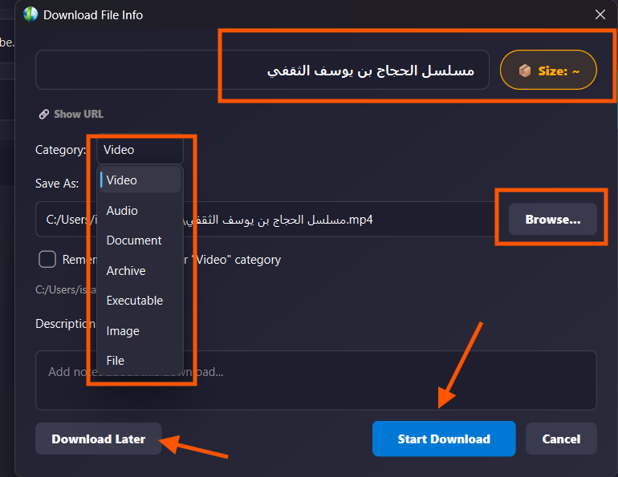
  <br>
  <em>Figure 2: Advanced Download Options - Customize Your Downloads</em>
</div>

### 📊 Playlist Manager

<div align="center">
  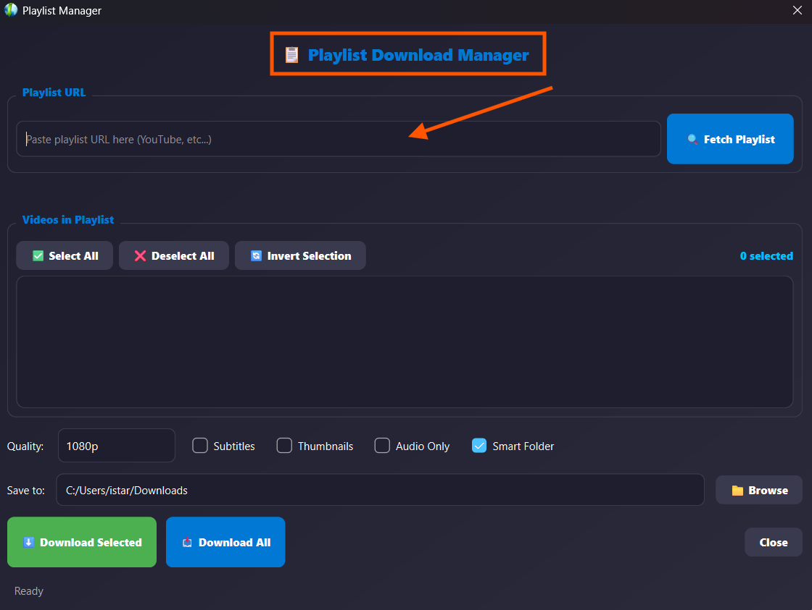
  <br>
  <em>Figure 3: Playlist Manager - Download Multiple Videos with Ease</em>
</div>

### 📋 Queue Manager

<div align="center">
  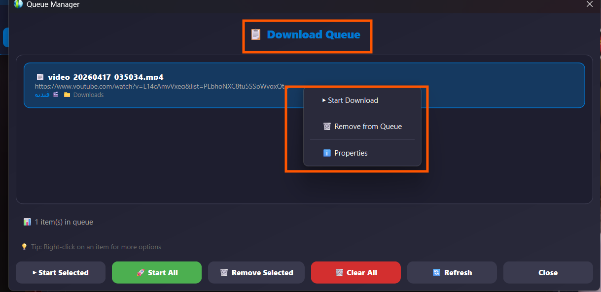
  <br>
  <em>Figure 4: Queue Manager - Organize Your Downloads Efficiently</em>
</div>

### 🖱️ Context Menus

<div align="center">
  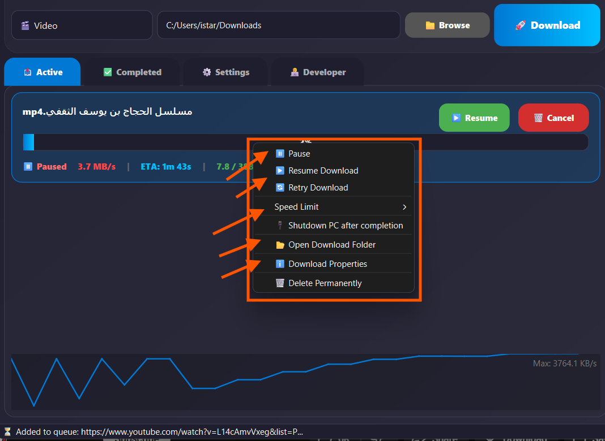
  <br>
  <em>Figure 5: Right-Click Context Menu - Quick Access to All Features</em>
</div>

### 📱 Mini Progress Window

<div align="center">
  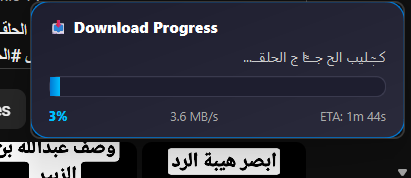
  <br>
  <em>Figure 6: Mini Progress Window - Stay Updated While Working</em>
</div>

### 🔽 System Tray Menu

<div align="center">
  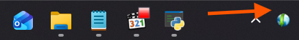
  <br>
  <em>Figure 7: System Tray Menu - Access MDM from Anywhere</em>
</div>

### 📱 Social Media Download - TikTok Example

<div align="center">
  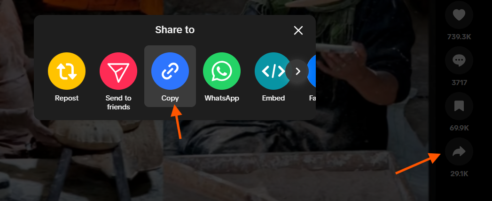
  <br>
  <em>Figure 8: Download from Social Media - Just Share & Copy Link!</em>
</div>

---

## 🚀 Installation Guide

### System Requirements

| Component | Minimum | Recommended |
|-----------|---------|-------------|
| **OS** | Windows 7 | Windows 10/11 |
| **RAM** | 2 GB | 4 GB |
| **Storage** | 200 MB | 500 MB |
| **Internet** | Broadband | High-Speed Broadband |

### Step-by-Step Installation

<div align="center">

#### Step 1: Extract the Archive

</div>

<div align="center">
  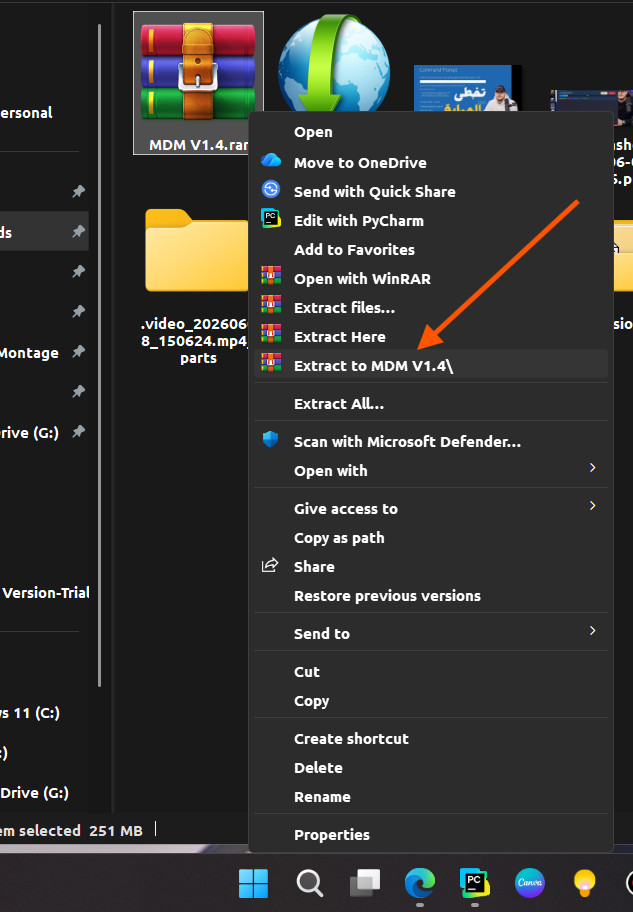
  <br>
  <em>Extract using WinRAR, 7-Zip, or any ZIP utility</em>
</div>

<div align="center">

#### Step 2: Locate Setup Folder

</div>

<div align="center">
  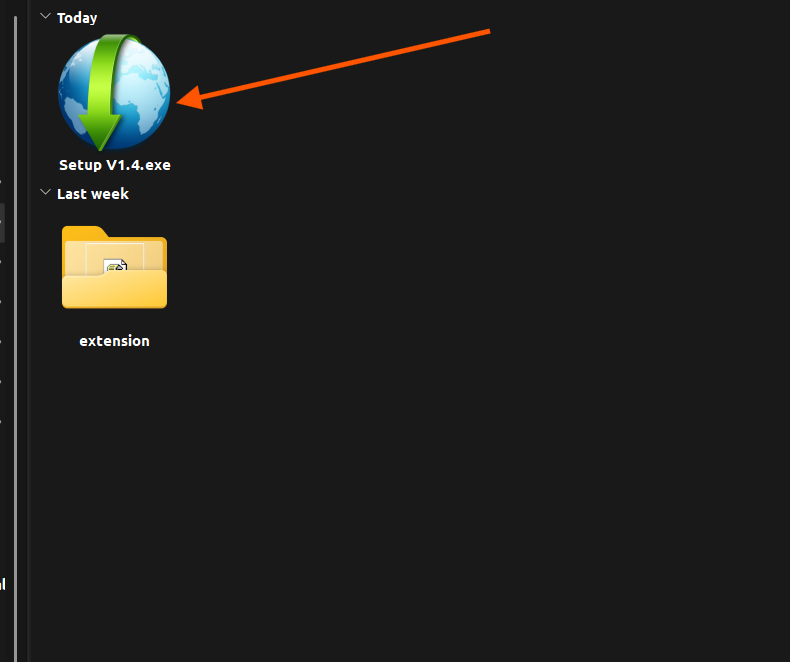
  <br>
  <em>You'll find two folders: setup and extension</em>
</div>

<div align="center">

#### Step 3: Run Installer

</div>

<div align="center">
  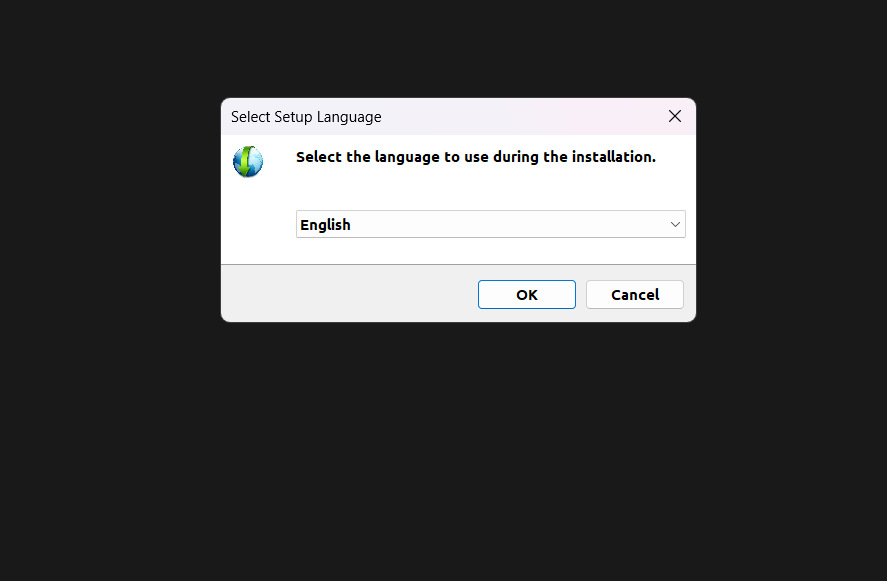
  <br>
  <em>Run setup.exe and follow the installation wizard</em>
</div>

<div align="center">

#### Step 4: Launch MDM

</div>

<div align="center">
  
  <br>
  <em>Launch from desktop or Start Menu</em>
</div>

---

## 🎯 How to Use

### 🚀 Quick Start Guide

1. **Copy** your download link (video or file URL)
2. **Paste** it into the URL field in MDM
3. **Select** download type (File/Video)
4. **Choose** your save folder
5. **Click** "Download Now"
6. **Configure** options in the dialog
7. **Start** downloading!

### 🎮 Power User Features

#### Smart Folders
```
Downloads/
├── Videos/
│   ├── YouTube/
│   │   ├── Channel Name/
│   │   └── Playlist Name/
│   ├── TikTok/
│   └── Instagram/
├── Audio/
├── Documents/
└── Programs/
```

#### Speed Control
- **Global Limit:** Set overall download speed
- **Per-Download Limit:** Set individual speed limits
- **Bandwidth Quota:** Set daily/weekly limits

#### Post-Download Actions
- 🔌 **Shutdown PC**
- 💤 **Sleep Mode**
- 🔄 **Hibernate**
- 📜 **Custom Script**
- ⏰ **Delayed Actions** (0-120 minutes)

---

## 🌐 Browser Extension Installation

<div align="center">

### **Add MDM to Your Browser!**

</div>

### Step-by-Step Guide

<div align="center">

#### Step 1: Open Browser Extensions

</div>

<div align="center">
  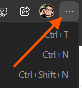
  <br>
  <em>Click the three dots → Extensions → Manage Extensions</em>
</div>

<div align="center">

#### Step 2: Enable Developer Mode

</div>

<div align="center">
  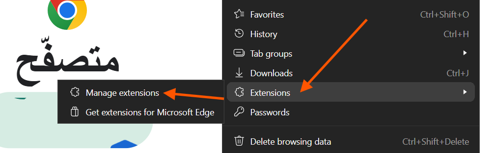
  <br>
  <em>Toggle Developer Mode in the top right</em>
</div>

<div align="center">

#### Step 3: Load Unpacked Extension

</div>

<div align="center">
  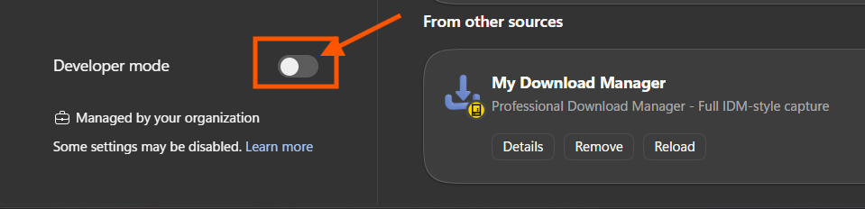
  <br>
  <em>Click "Load Unpacked" and select the extension folder</em>
</div>

<div align="center">

#### Step 4: Browse to Extension Folder

</div>

<div align="center">
  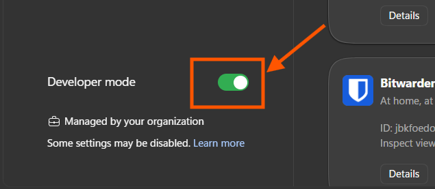
  <br>
  <em>Navigate to the extension folder in your extracted files</em>
</div>

<div align="center">

#### Step 5: Select the Folder

</div>

<div align="center">
  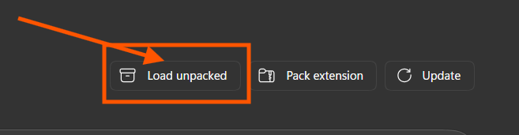
  <br>
  <em>Click "Select Folder" to load the extension</em>
</div>

<div align="center">

#### Step 6: Extension Loaded

</div>

<div align="center">
  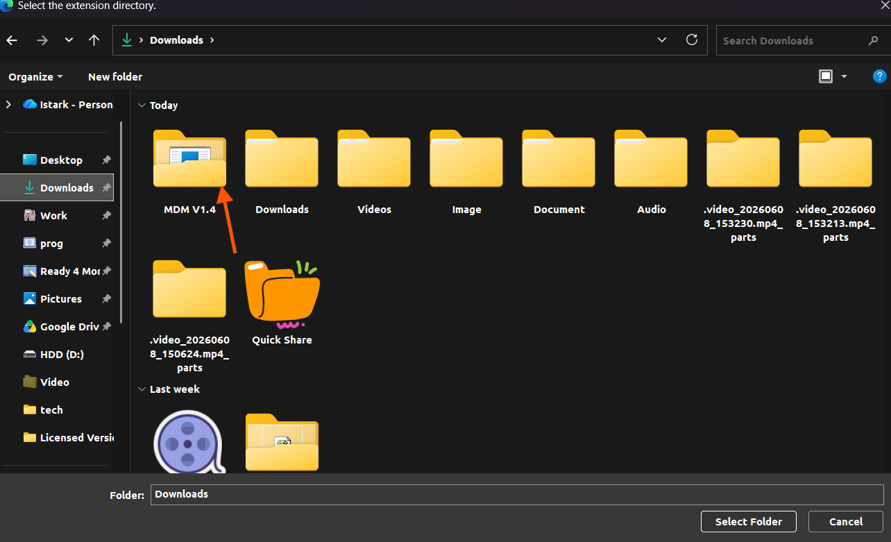
  <br>
  <em>The extension is now loaded in your browser</em>
</div>

<div align="center">

#### Step 7: Find the Extension

</div>

<div align="center">
  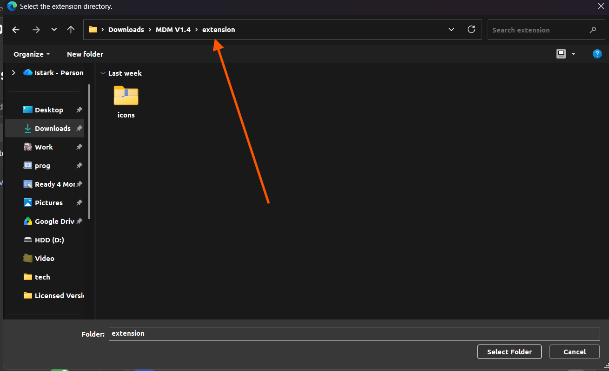
  <br>
  <em>Find MDM in your extensions list</em>
</div>

<div align="center">

#### Step 8: ✅ Complete!

</div>

<div align="center">
  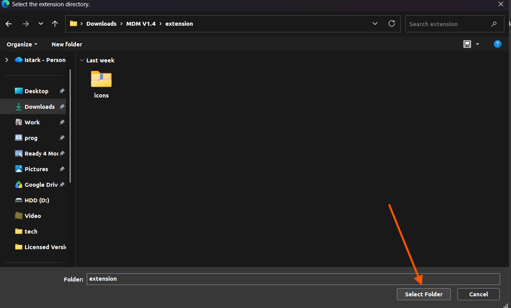
  <br>
  <em>Extension installed successfully!</em>
</div>

<div align="center">

#### Step 9: Pin to Toolbar

</div>

<div align="center">
  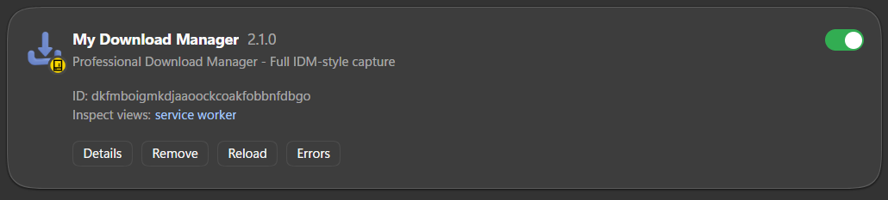
  <br>
  <em>Pin the extension for quick access</em>
</div>

<div align="center">

#### Step 10: Ready to Use!

</div>

<div align="center">
  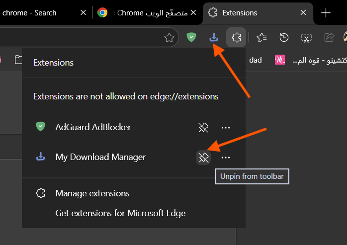
  <br>
  <em>MDM is now ready to capture your downloads!</em>
</div>

---

## 💡 Pro Tips

### 🎬 Video Downloads
- **YouTube:** Use "Share → Copy Link" for best results
- **TikTok:** Always use the share link method
- **Instagram:** Copy link from the post
- **Facebook:** Use the post's share link

### 🔐 File Integrity
- Enable Hash Verification in Settings
- MDM uses SHA-256 for verification
- Automatically verifies downloads

### 💼 Portable Mode
- Create `portable.ini` in app folder
- Settings saved in `settings.ini`
- No registry changes needed

### 🌍 Proxy Configuration
- HTTP, SOCKS4, SOCKS5 support
- Username/password authentication
- Apply to all downloads

---

## 🛠️ Troubleshooting

| Issue | Solution |
|-------|----------|
| **Download Doesn't Start** | Check internet connection and firewall |
| **4K Video Fails** | Install ffmpeg (bundled with MDM) |
| **Extension Not Working** | Ensure MDM is running and port 8765 is open |
| **Slow Downloads** | Check speed limits and bandwidth quota |
| **File Integrity Error** | Redownload the file |

---

## 📱 Connect With Us

<div align="center">

### 📲 **Follow Us for Updates & Support**

[](https://www.facebook.com/profile.php?id=61562014983841)
[](https://youtube.com/@kamel_ahmed)
[](https://paypal.me/kamelahmed306)
[](https://github.com/kezoooop)
[](https://x.com/the_starkk)
[](https://linkedin.com/in/kamel-ahmed-a844352aa)
[](https://kamelahmed.netlify.app)

</div>

---

## 👨‍💻 About the Developer

<div align="center">

### **Kamel Ahmed**
#### *Software Engineer & Developer | Code Security Analyst | Vulnerability Expert*

</div>

- 🎓 Studied at British Academy of Computer Science, London
- 🛡️ First Arabic security program with 10M+ downloads
- ✍️ Senior Technical Editor at Xdev global platform
- 📚 Head and Lecturer at Digital Egypt Program
- 💻 Expert in: Code Analysis, Application Security, 3D Design

---

<div align="center">

### ❤️ **Support the Developer** ❤️

[](https://paypal.me/kamelahmed306)

---

**© 2026 My Download Manager - Ultimate Final Edition. All rights reserved.**

*Made with ❤️ by [Kamel Ahmed](https://kamelahmed.netlify.app)*

</div>

---

# 🌟 النسخة العربية

<div align="center">


# ⚡ مدير التحميلات المتقدم (MDM)

### *ضاعف سرعة تحميلاتك حتى 8 مرات!*

</div>

---

## 🌐 الموقع الرسمي | Official Website

<div align="center">

### 🔗 **[https://mydownloadmanager.pages.dev/](https://mydownloadmanager.pages.dev/)**

**تحميل أحدث إصدار، احصل على الدعم، وابق على اطلاع!**  
**Download the latest version, get support, and stay updated!**

📧 **البريد الإلكتروني | Email:** **kamel.buisness@outlook.com**

</div>

---

## ✨ مقدمة

**مدير التحميلات المتقدم (MDM)** هو مسرع تحميل من الجيل التالي يحدث ثورة في طريقة تحميلك للملفات والفيديوهات من الإنترنت. بُني MDM بأحدث التقنيات، ويجمع بين السرعات الخاطفة والميزات الذكية التي تجعل التحميل سهلاً وممتعاً.

### لماذا MDM مميز؟

| الميزة | الفائدة |
|--------|---------|
| ⚡ **سرعة 8 أضعاف** | تحميل الملفات الكبيرة في دقائق بدلاً من ساعات |
| 🎯 **دعم شامل** | يعمل مع جميع المواقع وأنواع الملفات |
| 🔄 **استئناف ذكي** | لا تفقد تقدمك أبداً - استأنف من حيث توقفت |
| 🎬 **جودة 4K** | تحميل فيديوهات عالية الجودة من وسائل التواصل |
| 📋 **تكامل المتصفح** | التقاط التحميلات مباشرة من متصفحك |
| ⏰ **جدولة ذكية** | أتمتة التحميلات في أوقات محددة |
| 🔐 **التحقق من سلامة الملفات** | تأكد من أن تحميلاتك سليمة 100% |

---

## 🔥 الميزات الرئيسية

| الميزة | الوصف |
|--------|-------|
| 🎬 **تحميل الفيديو** | يوتيوب، تيك توك، انستجرام، فيسبوك، تويتر/إكس، بنترست، فيميو، ديلي موشن، تويتش |
| 📄 **تحميل الملفات** | جميع أنواع الملفات: مستندات، أرشيف، برامج، صور، صوت |
| 🎥 **جودة 4K** | حتى 4K (2160p)، 2K (1440p)، 1080p، 720p، 480p، 360p |
| 📋 **قوائم التشغيل** | تحميل قوائم تشغيل يوتيوب كاملة |
| 🌐 **تكامل المتصفح** | التقاط التحميلات مباشرة من المتصفح |
| 📋 **التقاط الحافظة** | اكتشاف الروابط المنسوخة تلقائياً |
| ⏸️ **إيقاف واستئناف** | إيقاف واستئناف التحميلات في أي وقت |
| ⚡ **التحكم بالسرعة** | حدود سرعة عامة وخاصة لكل تحميل |
| 📊 **مدير الطابور** | إدارة تحميلات متعددة بكفاءة |
| ⏰ **جدولة متقدمة** | جدولة التحميلات في أوقات محددة |
| 🔐 **التحقق من التجزئة** | التحقق من سلامة الملفات باستخدام SHA-256 |
| 📁 **مجلدات ذكية** | تنظيم تلقائي للتحميلات حسب المصدر والنوع |
| 🌍 **دعم الوكيل** | دعم HTTP، SOCKS4، SOCKS5 |
| 📊 **حصة النطاق الترددي** | تحديد حدود تحميل يومية/أسبوعية |
| 🔌 **إيقاف التشغيل التلقائي** | إيقاف التشغيل، السكون، أو الإسبات بعد اكتمال التحميلات |
| 🎵 **تنبيهات صوتية** | إشعارات صوتية لأحداث التحميل |
| 💼 **الوضع المحمول** | احمل إعداداتك معك أينما ذهبت |

---

## 📸 عرض التطبيق

### 🖥️ الواجهة الرئيسية

<div align="center">
  
  <br>
  <em>الشكل 1: الواجهة الرئيسية - مركز قيادة التحميلات</em>
</div>

### 📥 خيارات التحميل

<div align="center">
  
  <br>
  <em>الشكل 2: خيارات التحميل المتقدمة</em>
</div>

### 📊 مدير قوائم التشغيل

<div align="center">
  
  <br>
  <em>الشكل 3: تحميل قوائم التشغيل بسهولة</em>
</div>

### 📋 مدير الطابور

<div align="center">
  
  <br>
  <em>الشكل 4: تنظيم التحميلات بكفاءة</em>
</div>

### 🔽 قائمة شريط المهام

<div align="center">
  
  <br>
  <em>الشكل 5: الوصول إلى MDM من أي مكان</em>
</div>

---

## 🚀 دليل التثبيت

<div align="center">

#### الخطوة 1: فك ضغط الملف

</div>

<div align="center">
  
  <br>
  <em>فك الضغط باستخدام WinRAR أو 7-Zip</em>
</div>

<div align="center">

#### الخطوة 2: تحديد مجلد التثبيت

</div>

<div align="center">
  
  <br>
  <em>ستجد مجلدين: setup و extension</em>
</div>

<div align="center">

#### الخطوة 3: تشغيل المثبت

</div>

<div align="center">
  
  <br>
  <em>قم بتشغيل setup.exe واتبع التعليمات</em>
</div>

---

## 🌐 تثبيت إضافة المتصفح

<div align="center">

#### الخطوة 1: فتح إضافات المتصفح

</div>

<div align="center">
  
  <br>
  <em>اضغط على النقاط الثلاث → الإضافات → إدارة الإضافات</em>
</div>

<div align="center">

#### الخطوة 2: تفعيل وضع المطور

</div>

<div align="center">
  
  <br>
  <em>فعّل وضع المطور في أعلى اليمين</em>
</div>

<div align="center">

#### الخطوة 3: تحميل الإضافة

</div>

<div align="center">
  
  <br>
  <em>اضغط "تحميل غير معبأ" واختر مجلد الإضافة</em>
</div>

<div align="center">

#### الخطوة 4: ✅ اكتمل التثبيت!

</div>

<div align="center">
  
  <br>
  <em>تم تثبيت الإضافة بنجاح!</em>
</div>

---

## 📱 تواصل معنا

<div align="center">

### 📲 **تابعنا للتحديثات والدعم**

[](https://www.facebook.com/profile.php?id=61562014983841)
[](https://youtube.com/@kamel_ahmed)
[](https://paypal.me/kamelahmed306)
[](https://github.com/kezoooop)
[](https://x.com/the_starkk)
[](https://linkedin.com/in/kamel-ahmed-a844352aa)

</div>

---

<div align="center">

### ❤️ **ادعم المطور** ❤️

[](https://paypal.me/kamelahmed306)

---

**© 2026 مدير التحميلات المتقدم - النسخة النهائية المطورة. جميع الحقوق محفوظة.**

*تم الإنتاج بحب ❤️ بواسطة [كامل أحمد](https://kamelahmed.netlify.app)*

</div>

---

## 🎯 Quick Reference Guide

| Action | Shortcut |
|--------|----------|
| Paste URL | Ctrl + V |
| Start Download | Enter |
| Open Downloads Folder | Ctrl + O |
| Open Queue Manager | Ctrl + Q |
| Save Settings | Ctrl + S |
| Open Help | F1 |

---

## 📈 Statistics

<div align="center">

| Metric | Value |
|--------|-------|
| Total Downloads | 10,000,000+ |
| Supported Sites | 50+ |
| File Types | All |
| Max Speed | 8x Faster |
| Languages | 2 (EN/AR) |

</div>

---

<div align="center">

### 🚀 **Start Downloading Faster Today!** 🚀

[](https://github.com/kezoooop/MyDownloadManager/releases)

</div>
