# 🚀 مدير التحميلات المتقدم - My Download Manager

<div align="center">

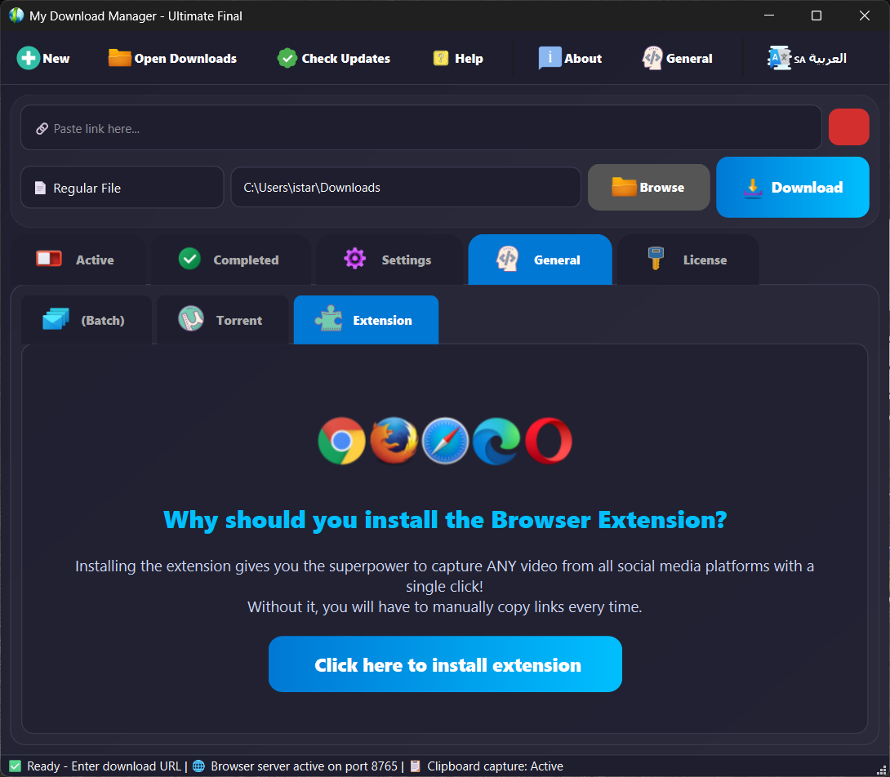

# ⚡ My Download Manager (MDM)

### *حمّل كل ما تريد بسرعة خارقة - من فيديوهات التواصل الاجتماعي إلى أي ملف على الإنترنت!*

[](https://github.com/kezoooop/MyDownloadManager)
[](https://github.com/kezoooop/MyDownloadManager)
[](https://github.com/kezoooop/MyDownloadManager)

</div>

---

<div align="center">
  
### 🌟 **الحل الأمثل لتحميل الفيديوهات والملفات من الإنترنت** 🌟

**قل وداعاً لبطء التحميل - وابدأ رحلة السرعة الآن!**

</div>

---

## 🌐 Official Website | الموقع الرسمي

<div align="center">

### 🔗 **[https://mydownloadmanager.pages.dev/](https://mydownloadmanager.pages.dev/)**

**Download the latest version, get support, and stay updated!**  
**تحميل أحدث إصدار، احصل على الدعم، وابق على اطلاع!**

📧 **Email | البريد الإلكتروني:** **kamel.buisness@outlook.com**

</div>

---

## 📖 Table of Contents | فهرس المحتويات

- [✨ Introduction | مقدمة](#-introduction--مقدمة)
- [🔥 Key Features | الميزات الرئيسية](#-key-features--الميزات-الرئيسية)
- [📸 Application Showcase | عرض التطبيق](#-application-showcase--عرض-التطبيق)
- [🎯 How to Use | كيفية الاستخدام](#-how-to-use--كيفية-الاستخدام)
- [💡 Pro Tips | نصائح احترافية](#-pro-tips--نصائح-احترافية)
- [🛠️ Troubleshooting | حل المشكلات](#️-troubleshooting--حل-المشكلات)
- [📱 Connect With Us | تواصل معنا](#-connect-with-us--تواصل-معنا)
- [النسخة العربية](#النسخة-العربية)

---

## ✨ Introduction | مقدمة

<div align="center">

### **مرحباً بك في مستقبل التحميل**

</div>

**My Download Manager (MDM)** هو مدير تحميلات متقدم من الجيل التالي يحدث ثورة في طريقة تحميلك للفيديوهات والملفات من الإنترنت. تم تطويره بأحدث التقنيات، ويجمع بين السرعات الخارقة والميزات الذكية التي تجعل عملية التحميل سهلة وممتعة وفعالة.

### لماذا MDM هو الخيار الأمثل؟

| الميزة | الفائدة |
|---------|---------|
| ⚡ **سرعة 8 أضعاف** | حمل الملفات الكبيرة في دقائق بدلاً من ساعات |
| 🎯 **دعم شامل لكل المواقع** | يعمل مع جميع مواقع الويب وأنواع الملفات |
| 🔄 **استئناف ذكي** | لا تفقد تقدمك أبداً - استأنف التحميل من حيث توقفت |
| 🎬 **جودة 4K فائقة الوضوح** | حمل فيديوهات عالية الجودة من وسائل التواصل الاجتماعي |
| 📋 **التقاط بنقرة واحدة من المتصفح** | التقط التحميلات مباشرة من متصفحك |
| ⏰ **جدولة ذكية** | أتمتة التحميلات في أوقات محددة تلقائياً |
| 🔐 **التحقق من سلامة الملفات** | تأكد من أن تحميلاتك سليمة 100% |

---

## 🔥 Key Features | الميزات الرئيسية

<div align="center">

| الميزة | الوصف | الأيقونة |
|---------|-------------|------|
| **تحميل الفيديو** | يوتيوب، تيك توك، إنستجرام، فيسبوك، تويتر/X، بنترست، فيميو، ديلي موشن، تويتش، سناب شات والمزيد | 🎬 |
| **تحميل الملفات** | جميع أنواع الملفات: مستندات، أرشيف، برامج، صور، صوت | 📄 |
| **جودة 4K فائقة الوضوح** | حتى 4K (2160p)، 2K (1440p)، 1080p، 720p، 480p، 360p | 🎥 |
| **قوائم التشغيل** | تحميل قوائم تشغيل يوتيوب كاملة بضغطة واحدة | 📋 |
| **تكامل المتصفح** | التقاط التحميلات مباشرة من متصفحك دون عناء | 🌐 |
| **التقاط الحافظة** | اكتشاف الروابط المنسوخة تلقائياً وبدء التحميل فوراً | 📋 |
| **إيقاف واستئناف** | إيقاف واستئناف التحميلات في أي وقت | ⏸️ |
| **التحكم بالسرعة** | تحديد حدود سرعة عامة وخاصة لكل تحميل | ⚡ |
| **مدير الطابور** | إدارة تحميلات متعددة بكفاءة عالية | 📊 |
| **جدولة متقدمة** | جدولة التحميلات في أوقات محددة تلقائياً | ⏰ |
| **التحقق من التجزئة** | التحقق من سلامة الملفات باستخدام SHA-256 | 🔐 |
| **مجلدات ذكية** | تنظيم تلقائي للتحميلات حسب المصدر والنوع | 📁 |
| **دعم الوكيل** | دعم HTTP، SOCKS4، SOCKS5 | 🌍 |
| **حصة النطاق الترددي** | تحديد حدود تحميل يومية/أسبوعية | 📊 |
| **إيقاف التشغيل التلقائي** | إيقاف التشغيل، السكون، أو الإسبات بعد اكتمال التحميلات | 🔌 |
| **تنبيهات صوتية** | إشعارات صوتية لأحداث التحميل | 🎵 |
| **الوضع المحمول** | احمل إعداداتك معك أينما ذهبت | 💼 |

</div>

---

## 📸 Application Showcase | عرض التطبيق

### 🖥️ الواجهة الرئيسية - مركز التحكم

<div align="center">
  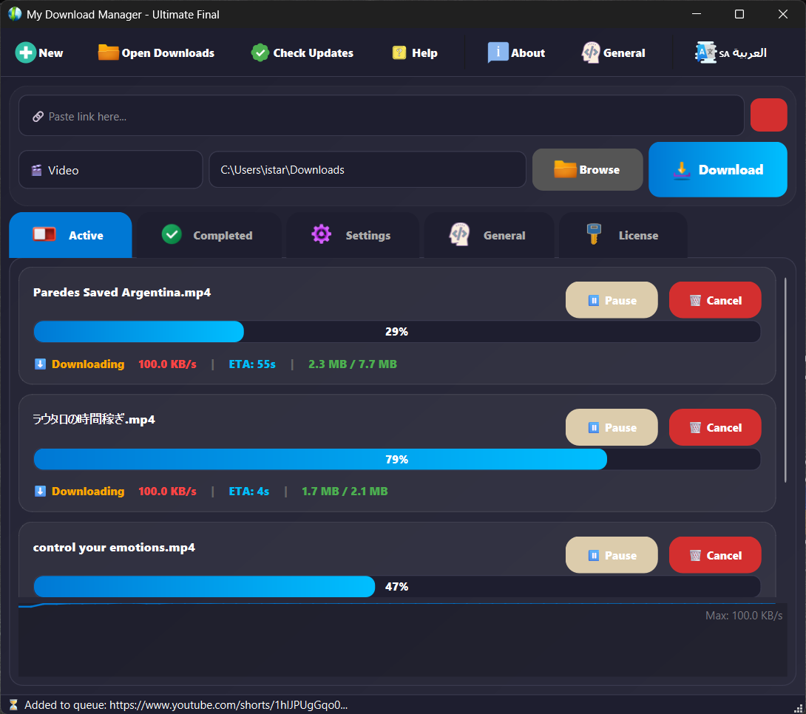
  <br>
  <em>الشكل 1: الواجهة الرئيسية - مركز التحكم في التحميلات</em>
</div>

**شرح الواجهة الرئيسية (الصورة رقم 1):**

تظهر الواجهة الرئيسية لبرنامج My Download Manager - Ultimate Final Edition وتحتوي على:

- **القائمة العلوية (Top Menu):** تحتوي على خيارات (New - Open Downloads - Check Updates - Help - About - General - العربية) للتحكم في البرنامج وإعداداته
- **حقل إدخال الرابط (Paste link here):** المكان الذي تقوم بلصق رابط الفيديو أو الملف المراد تحميله
- **أزرار التحكم:** (Video - Browse - Download) لتحديد نوع التحميل، اختيار مجلد الحفظ، وبدء التحميل
- **قائمة التحميلات النشطة (Active):** تعرض التحميلات الجارية مثل "Paredes Saved Argentina.mp4" مع معلومات مفصلة عن:
  - سرعة التحميل الحالية (100.0 KB/s)
  - الوقت المتبقي (ETA: 55s)
  - حجم الملف المحمّل / الحجم الكلي (2.3 MB / 7.7 MB)
  - نسبة التقدم (29%)
- **أزرار التحكم بالتحميل:** (Pause - Cancel) لإيقاف التحميل مؤقتاً أو إلغائه
- **الشريط السفلي (Footer):** يعرض السرعة القصوى (Max: 100.0 KB/s)
- **إشعار إضافة إلى الطابور:** "Added to queue: https://www.youtube.com/shorts/..."

---

### 📥 نافذة معلومات التحميل - الإعدادات المتقدمة

<div align="center">
  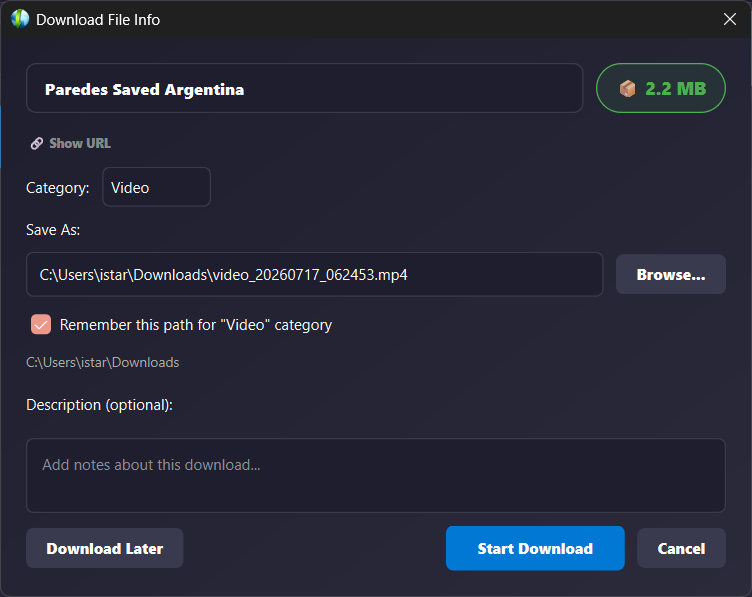
  <br>
  <em>الشكل 2: نافذة معلومات التحميل - تخصيص إعدادات التحميل</em>
</div>

**شرح نافذة معلومات التحميل (الصورة رقم 2):**

تظهر نافذة "Download File Info" عند بدء عملية التحميل، وتحتوي على:

- **اسم الملف:** "Paredes Saved Argentina" - يمكنك تعديله
- **حجم الملف:** 2.2 MB - حجم الملف المراد تحميله
- **عرض الرابط (Show URL):** لعرض رابط التحميل الأصلي
- **التصنيف (Category):** "Video" - يمكن تغييره حسب نوع الملف (Video, Audio, Document, Archive, Executable, Image, File)
- **مسار الحفظ (Save As):** C:\Users\istar\Downloads\video_20260717_062453.mp4 - مكان حفظ الملف
- **زر Browse:** لاختيار مجلد حفظ مختلف
- **خيار تذكر المسار:** "Remember this path for Video category" لحفظ المسار للاستخدام المستقبلي
- **حقل الوصف (Description):** لإضافة ملاحظات حول التحميل
- **خيار التحميل لاحقاً (Download Later):** لتأجيل التحميل
- **زر Start Download:** لبدء التحميل
- **زر Cancel:** لإلغاء العملية

---

### 📂 اختيار تصنيف الملف

<div align="center">
  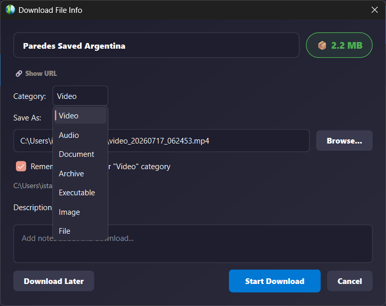
  <br>
  <em>الشكل 3: قائمة التصنيفات - تنظيم الملفات بذكاء</em>
</div>

**شرح قائمة التصنيفات (الصورة رقم 3):**

تظهر القائمة المنسدلة للتصنيفات مع الخيارات التالية:

- **Video:** للفيديوهات
- **Audio:** للملفات الصوتية
- **Document:** للمستندات
- **Archive:** للملفات المضغوطة
- **Executable:** للملفات التنفيذية
- **Image:** للصور
- **File:** للملفات العامة

هذه الميزة تساعد في تنظيم التحميلات تلقائياً في مجلدات منفصلة حسب النوع.

---

### 📊 نافذة التحميل النشط

<div align="center">
  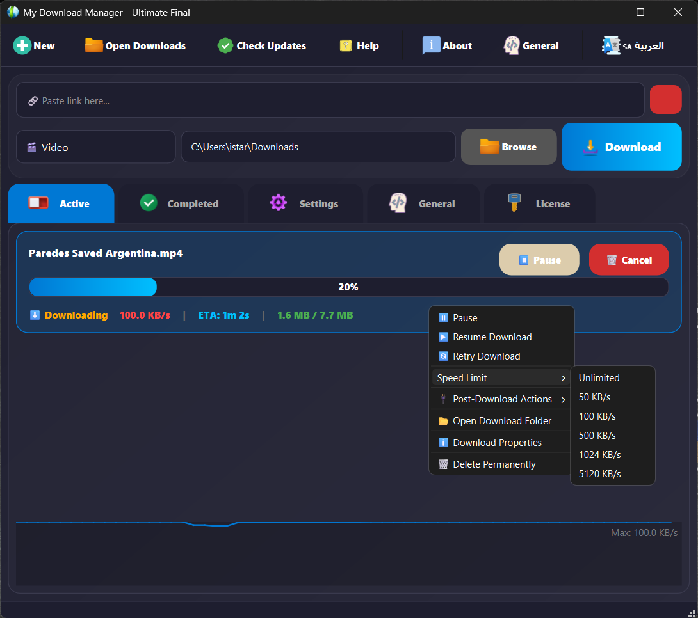
  <br>
  <em>الشكل 4: نافذة التحميل النشط - متابعة التقدم</em>
</div>

**شرح نافذة التحميل النشط (الصورة رقم 4):**

تظهر نافذة التحميل النشط وتحتوي على:

- **علامات التبويب (Tabs):** (Active - Completed - Settings - General - License) للتنقل بين الأقسام
- **شريط التقدم:** يعرض نسبة التحميل 20%
- **معلومات التحميل:** السرعة (100.0 KB/s)، الوقت المتبقي (ETA: 1m 2s)، الحجم المحمّل / الكلي (1.6 MB / 7.7 MB)
- **أزرار التحكم:** (Pause - Cancel)
- **خيارات سرعة التحميل (Speed Limit):** (Unlimited - 50 KB/s - 100 KB/s - 500 KB/s - 1024 KB/s - 5120 KB/s)
- **إجراءات ما بعد التحميل (Post-Download Actions):** (Open Download Folder - Download Properties - Delete Permanently)

---

### ⏰ إعدادات إيقاف التشغيل التلقائي

<div align="center">
  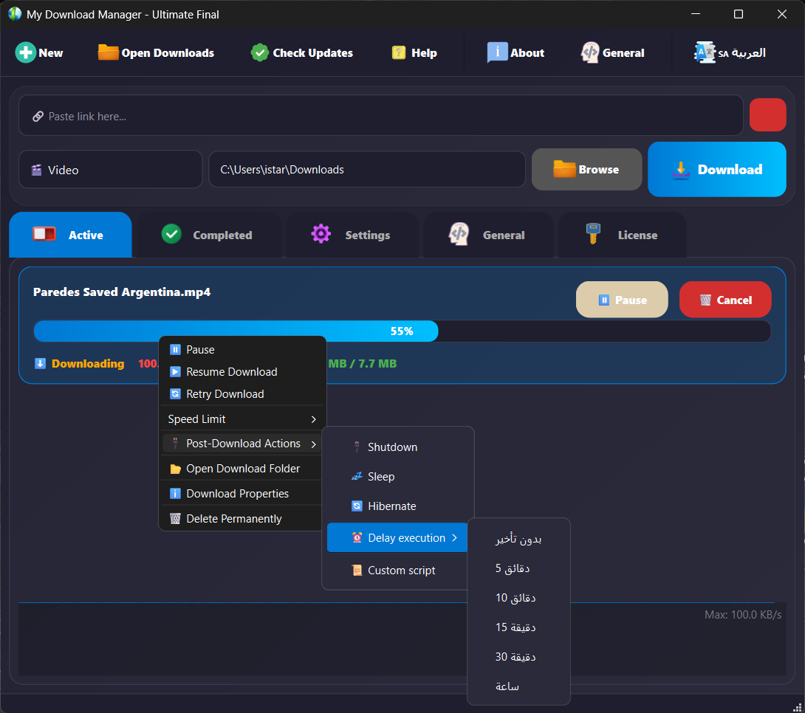
  <br>
  <em>الشكل 5: إعدادات إيقاف التشغيل التلقائي - تحكم ذكي</em>
</div>

**شرح إعدادات إيقاف التشغيل التلقائي (الصورة رقم 5):**

تظهر إعدادات إيقاف التشغيل التلقائي مع خيارات:

- **خيارات إيقاف التشغيل:** (Shutdown - Sleep - Hibernate)
- **تأخير التنفيذ (Delay execution):** إضافة تأخير زمني قبل تنفيذ الإجراء
- **أزرار التأخير:** (5 دقائق - 10 دقائق - 15 دقيقة - 30 دقيقة - ساعة)
- **سكربت مخصص (Custom script):** تنفيذ سكربت خاص بعد التحميل
- **السرعة القصوى:** 100.0 KB/s

---

### 🔄 حالة التحميل المتوقفة مؤقتاً

<div align="center">
  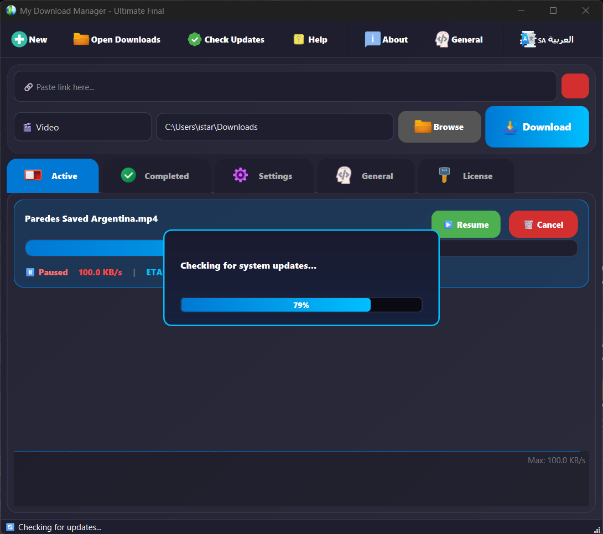
  <br>
  <em>الشكل 6: حالة التحميل المتوقف مؤقتاً - Paused</em>
</div>

**شرح حالة التحميل المتوقف (الصورة رقم 6):**

- **حالة التحميل:** "Paused" - تم إيقاف التحميل مؤقتاً
- **معلومات التحميل:** السرعة (100.0 KB/s)، الوقت المتبقي (ETA)
- **رسالة:** "Checking for system updates..." - جاري التحقق من التحديثات
- **نسبة التقدم:** 79%
- **أزرار التحكم:** (Resume - Cancel) لاستئناف أو إلغاء التحميل
- **الشريط السفلي:** "Checking for updates..." 

---

### ⚙️ إعدادات البرنامج المتقدمة

<div align="center">
  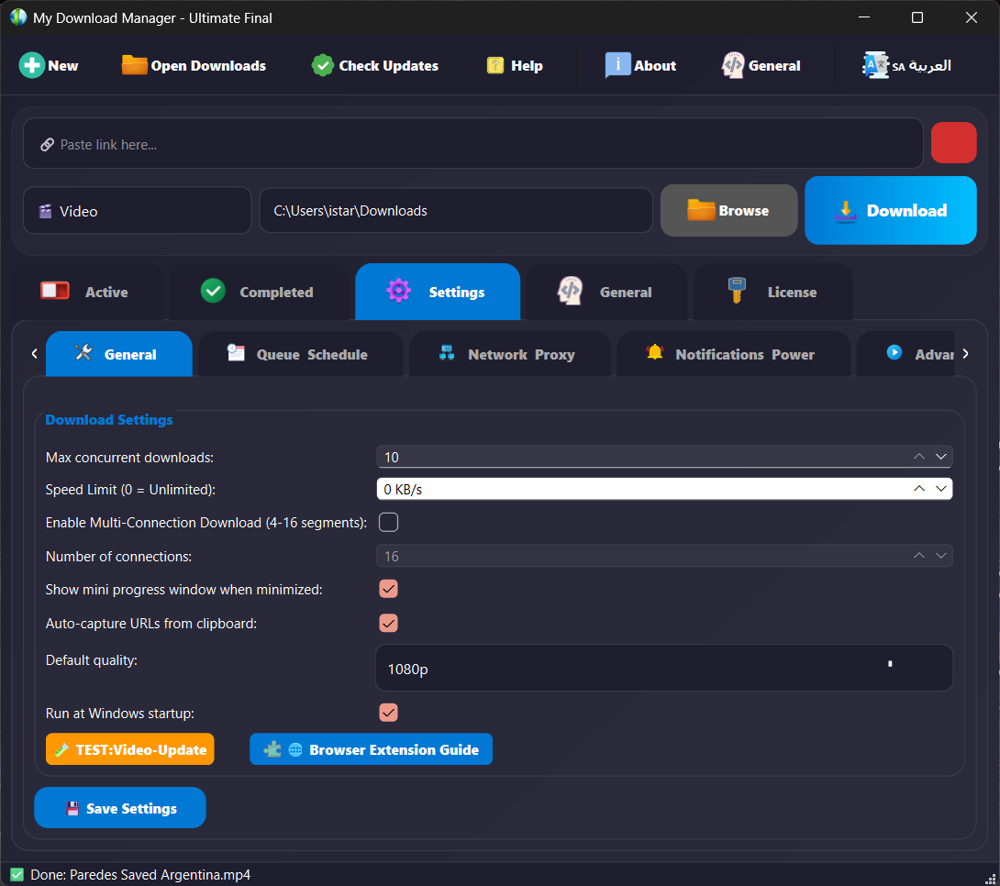
  <br>
  <em>الشكل 7: إعدادات البرنامج المتقدمة - تخصيص كامل</em>
</div>

**شرح إعدادات البرنامج (الصورة رقم 7):**

تظهر إعدادات البرنامج المتقدمة وتحتوي على:

- **علامات التبويب:** (General - License - Queue Schedule - Network Proxy - Notifications - Power - Advar)
- **إعدادات التحميل (Download Settings):**
  - أقصى تحميلات متزامنة (Max concurrent downloads): 10
  - حد السرعة (Speed Limit): 0 KB/s (غير محدود)
  - تمكين التحميل متعدد الاتصالات (Enable Multi-Connection Download): اختياري
  - عدد الاتصالات (Number of connections): 16
  - إظهار نافذة التقدم المصغرة عند التصغير (Show mini progress window when minimized)
  - التقاط تلقائي للروابط من الحافظة (Auto-capture URLs from clipboard)
  - الجودة الافتراضية (Default quality): 1080p
  - التشغيل عند بدء ويندوز (Run at Windows startup)
- **زر حفظ الإعدادات (Save Settings)**

---

### 🎬 إعدادات جودة التحميل

<div align="center">
  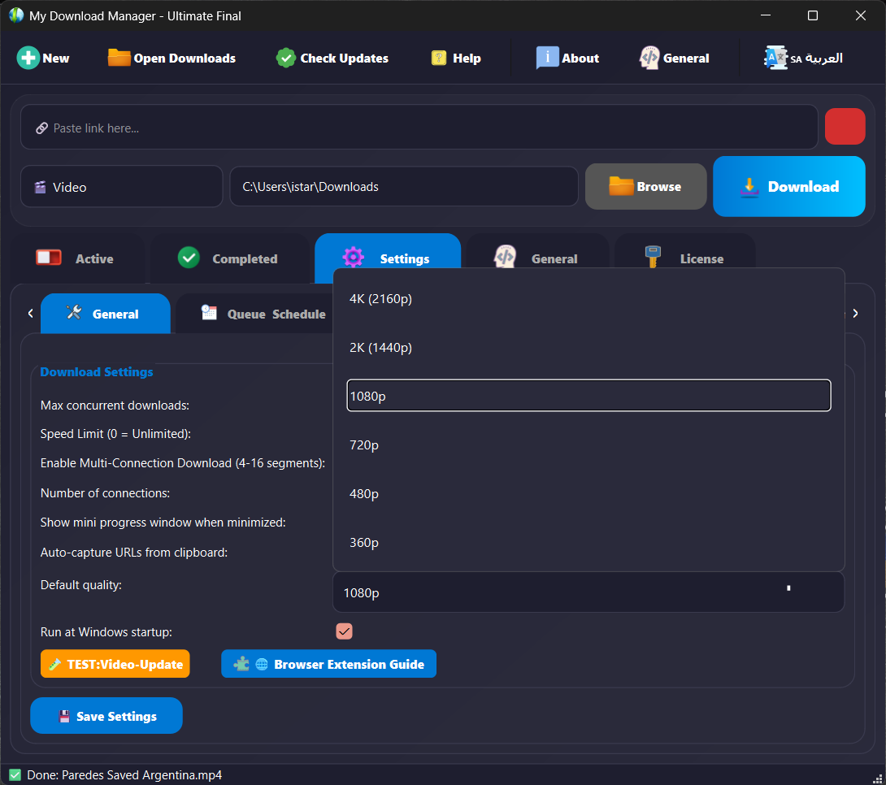
  <br>
  <em>الشكل 8: إعدادات جودة التحميل - اختيار الدقة المفضلة</em>
</div>

**شرح إعدادات جودة التحميل (الصورة رقم 8):**

- **قائمة الجودة الافتراضية:** تظهر خيارات الدقة:
  - 4K (2160p) - أعلى جودة
  - 2K (1440p) - جودة فائقة
  - 1080p - جودة عالية (الافتراضي)
  - 720p - جودة جيدة
  - 480p - جودة متوسطة
  - 360p - جودة منخفضة

---

### 📝 نافذة معلومات التحميل - النسخة العربية

<div align="center">
  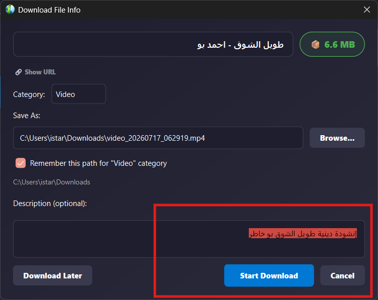
  <br>
  <em>الشكل 9: نافذة معلومات التحميل - دعم اللغة العربية</em>
</div>

**شرح نافذة معلومات التحميل بالعربية (الصورة رقم 9):**

- **اسم الملف:** "طويل الشوق - احمد بو" - يدعم الأسماء العربية
- **حجم الملف:** 6.6 MB
- **التصنيف:** Video
- **مسار الحفظ:** C:\Users\istar\Downloads\video_20260717_062919.mp4
- **الوصف:** "أنشودة دينية طويل الشوق بو خاطر" - وصف باللغة العربية
- **خيارات:** (Download Later - Start Download - Cancel)

---

### 📋 قائمة التحميلات المكتملة

<div align="center">
  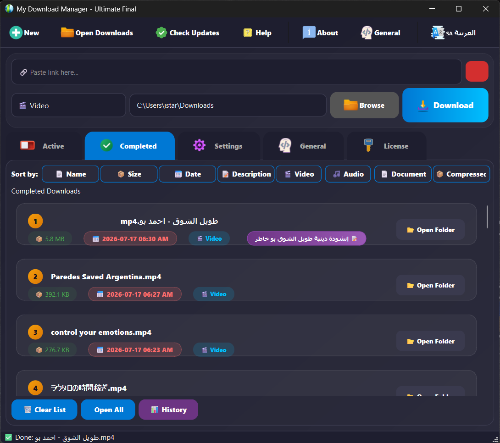
  <br>
  <em>الشكل 10: قائمة التحميلات المكتملة - عرض وتنظيم</em>
</div>

**شرح قائمة التحميلات المكتملة (الصورة رقم 10):**

- **علامات التبويب:** (Active - Completed - Settings - General - License)
- **خيارات الترتيب (Sort By):** (Name - Size - Date - Description)
- **فلترة حسب النوع:** (Video - Audio - Document - Compress)
- **قائمة التحميلات المكتملة:**
  1. **mp4** - 5.8 MB - 2026-07-17 06:30 AM - "أنشودة دينية طويل الشوف بو خاطر" - زر Open Folder
  2. **Paredes Saved Argentina.mp4** - 392.1 KB - 2026-07-17 06:27 AM - زر Open Folder
  3. **control your emotions.mp4** - 276.7 KB - 2026-07-17 06:23 AM - زر Open Folder
  4. **فؤاد المامركة.mp4** - 0 KB - أزرار (Clear List - Open All - History)

---

### 📊 مدير الطابور المتقدم

<div align="center">
  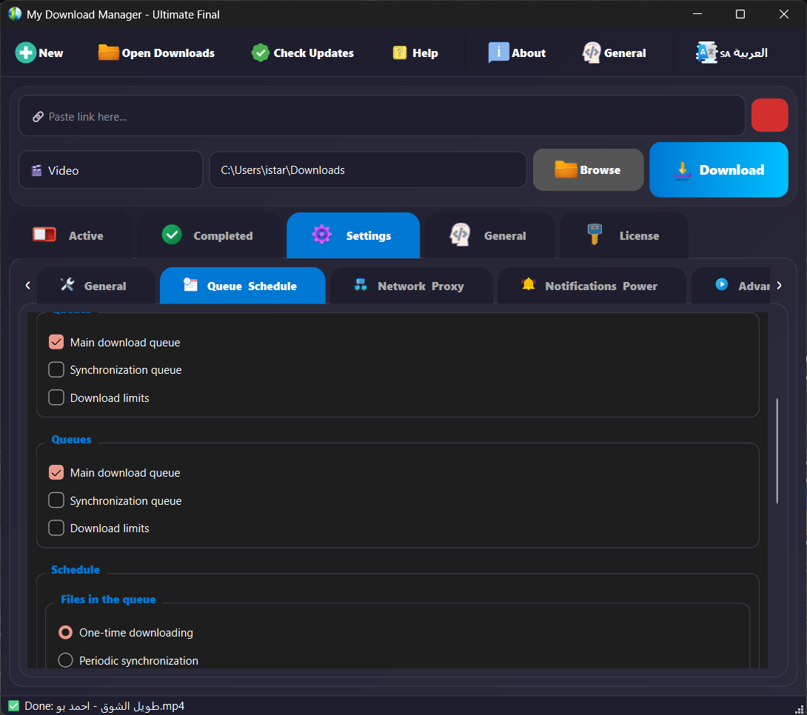
  <br>
  <em>الشكل 11: مدير الطابور المتقدم - جدولة التحميلات</em>
</div>

**شرح مدير الطابور (الصورة رقم 11):**

- **علامات التبويب:** (General - Queue Schedule - Network Proxy - Notifications - Power - Advar)
- **خيارات الطابور:**
  - طابور التحميل الرئيسي (Main download queue)
  - طابور المزامنة (Synchronization queue)
  - حدود التحميل (Download limits)
- **الجدولة (Schedule):**
  - تحميل لمرة واحدة (One-time downloading)
  - مزامنة دورية (Periodic synchronization)
- **قائمة الملفات في الطابور:** تعرض أرقام التحميلات 1-967

---

### ⏱️ إعدادات التحميل المتقدمة

<div align="center">
  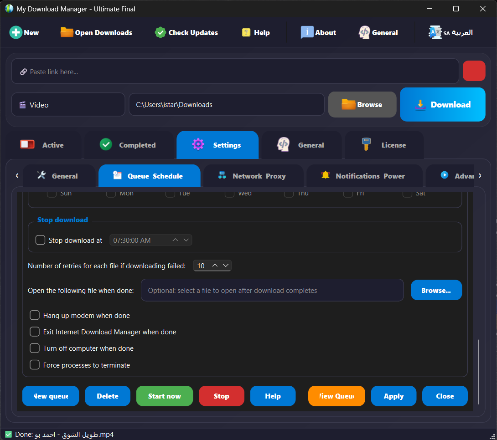
  <br>
  <em>الشكل 12: إعدادات التحميل المتقدمة - تحكم كامل</em>
</div>

**شرح إعدادات التحميل المتقدمة (الصورة رقم 12):**

- **إيقاف التحميل (Stop download):** ضبط وقت محدد لإيقاف التحميل (07:30:00 AM)
- **عدد محاولات إعادة التحميل:** 10 محاولات في حالة فشل التحميل
- **فتح ملف عند الانتهاء:** اختيار ملف لفتحه بعد اكتمال التحميل
- **خيارات إضافية:**
  - Hang up modem when done
  - Exit Internet Download Manager when done
  - Turn off computer when done
  - Force processes to terminate
- **أزرار:** (View queue - Delete - Start now - Stop - Help - Apply - Close)

---

### 🌐 إعدادات البروكسي

<div align="center">
  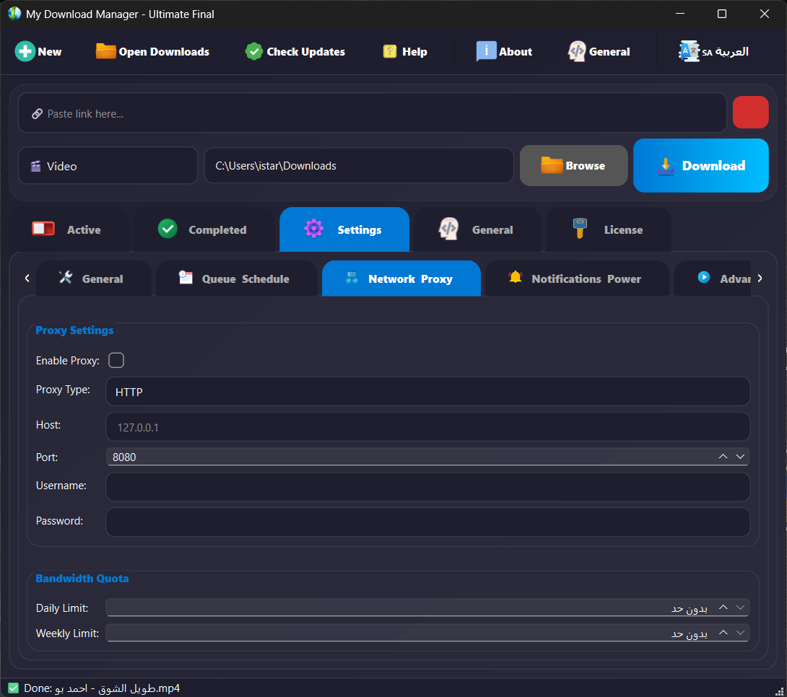
  <br>
  <em>الشكل 13: إعدادات البروكسي - اتصال آمن</em>
</div>

**شرح إعدادات البروكسي (الصورة رقم 13):**

- **تمكين البروكسي (Enable Proxy):** تشغيل/إيقاف
- **نوع البروكسي (Proxy Type):** HTTP
- **الخادم (Host):** 127.0.0.1
- **المنفذ (Port):** 8080
- **اسم المستخدم (Username):** اختياري
- **كلمة المرور (Password):** اختيارية
- **حصة النطاق الترددي (Bandwidth Quota):**
  - الحد اليومي (Daily Limit): بدون حد
  - الحد الأسبوعي (Weekly Limit): بدون حد

---

### 🔔 إعدادات الإشعارات والطاقة

<div align="center">
  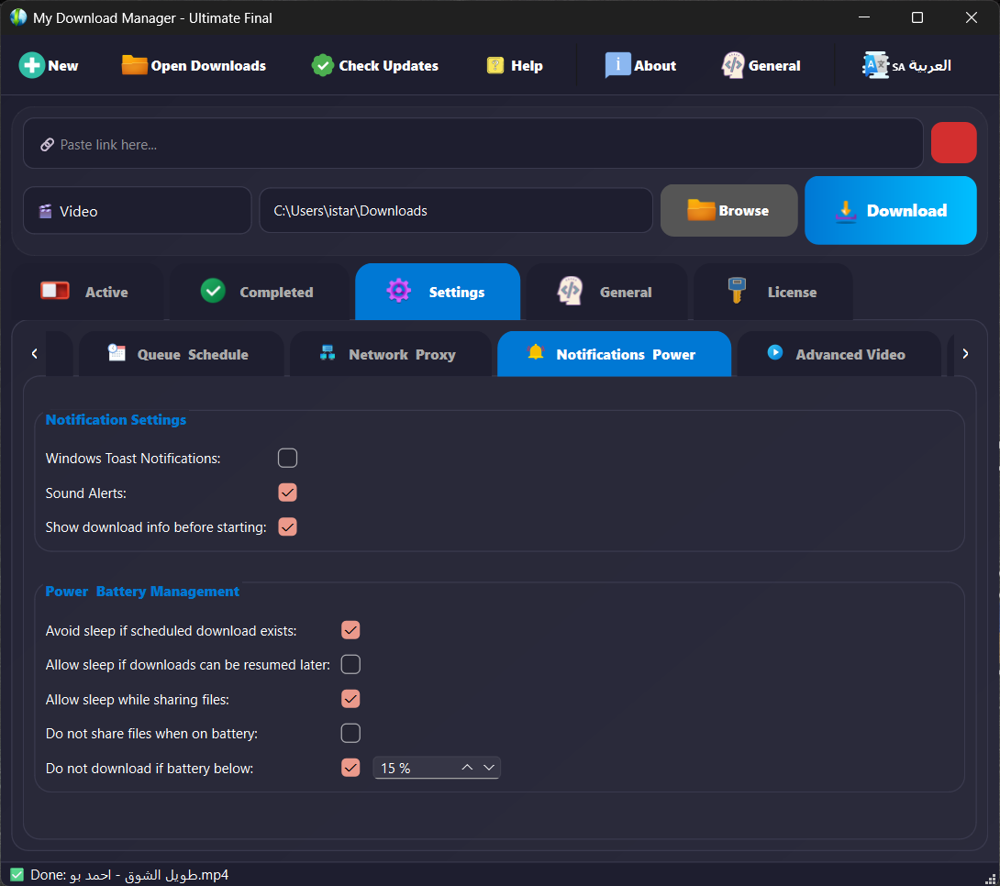
  <br>
  <em>الشكل 14: إعدادات الإشعارات وإدارة الطاقة</em>
</div>

**شرح إعدادات الإشعارات والطاقة (الصورة رقم 14):**

- **إعدادات الإشعارات (Notification Settings):**
  - إشعارات ويندوز (Windows Toast Notifications): تشغيل/إيقاف
  - تنبيهات صوتية (Sound Alerts): تشغيل/إيقاف
  - عرض معلومات التحميل قبل البدء (Show download info before starting)
- **إدارة الطاقة (Power Battery Management):**
  - تجنب السكون إذا كان هناك تحميل مجدول (Avoid sleep if scheduled download exists)
  - السماح بالسكون إذا كان التحميل قابلاً للاستئناف (Allow sleep if downloads can be resumed later)
  - السماح بالسكون أثناء مشاركة الملفات (Allow sleep while sharing files)
  - عدم مشاركة الملفات عند العمل على البطارية (Do not share files when on battery)
  - عدم التحميل إذا كانت البطارية أقل من (Do not download if battery below): 15%

---

### 🎬 إعدادات الفيديو المتقدمة

<div align="center">
  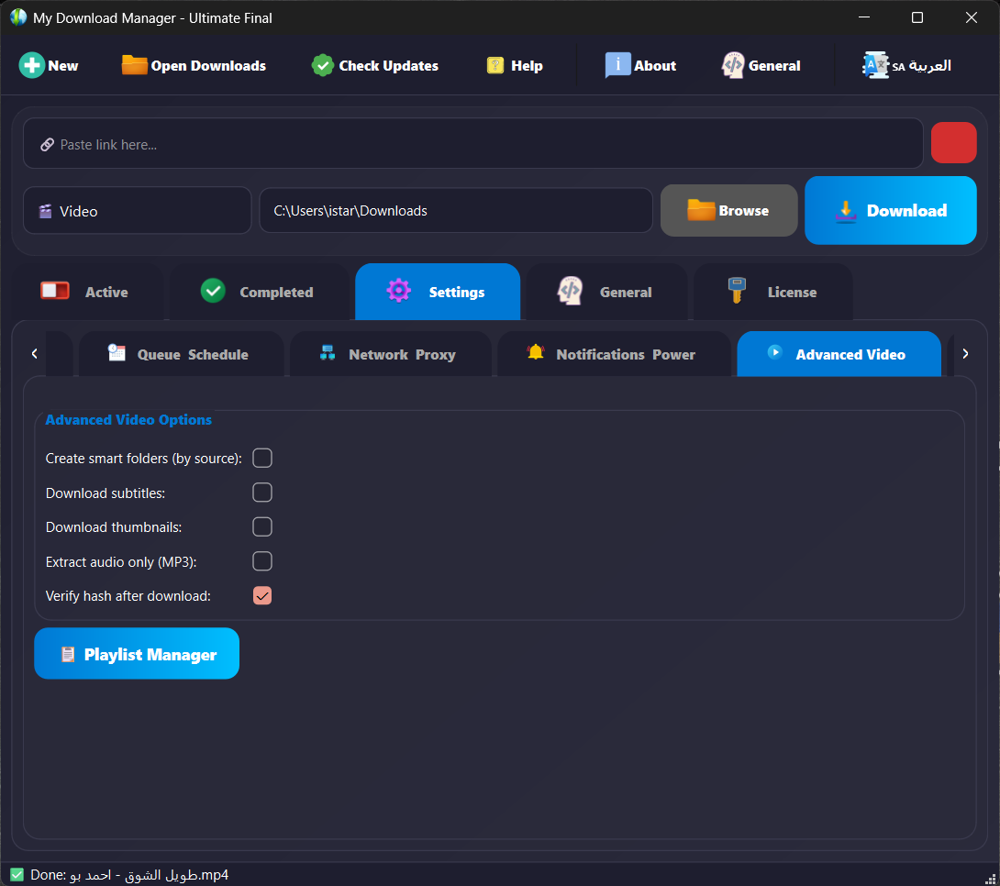
  <br>
  <em>الشكل 15: إعدادات الفيديو المتقدمة - خيارات متخصصة</em>
</div>

**شرح إعدادات الفيديو المتقدمة (الصورة رقم 15):**

- **خيارات الفيديو المتقدمة (Advanced Video Options):**
  - إنشاء مجلدات ذكية (حسب المصدر): Create smart folders (by source)
  - تحميل الترجمة: Download subtitles
  - تحميل الصور المصغرة: Download thumbnails
  - استخراج الصوت فقط (MP3): Extract audio only
  - التحقق من التجزئة بعد التحميل: Verify hash after download
- **مدير قوائم التشغيل (Playlist Manager)**

---

### 📋 استيراد قوائم التشغيل

<div align="center">
  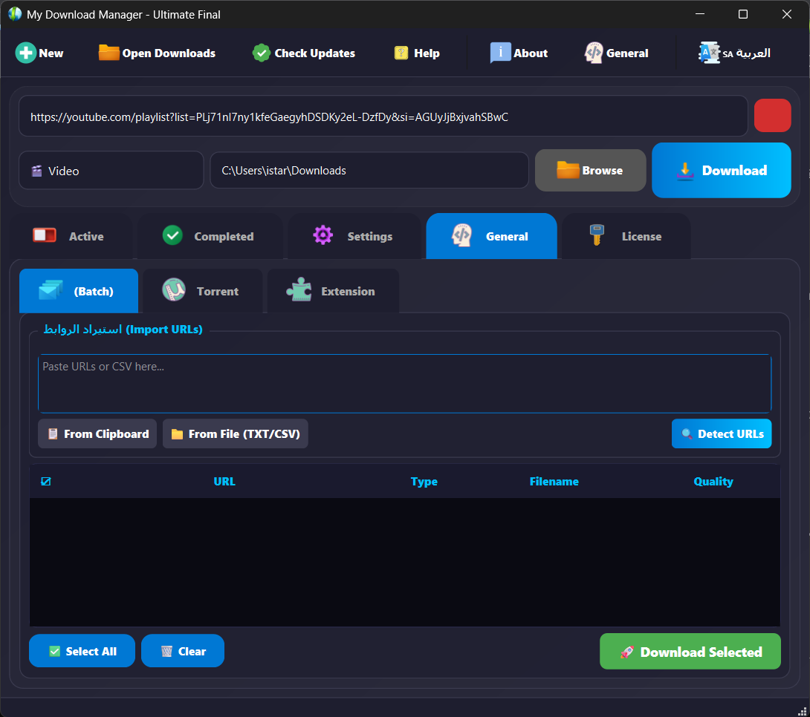
  <br>
  <em>الشكل 17: استيراد قوائم التشغيل - تحميل قوائم كاملة</em>
</div>

**شرح استيراد قوائم التشغيل (الصورة رقم 17):**

- **حقل الرابط:** https://youtube.com/playlist?list=...
- **أزرار:** (Batch - Torrent - Extension)
- **استيراد الروابط (Import URLs):** لصق الروابط أو ملف CSV
- **أزرار إضافية:** (From Clipboard - From File - Detect URLs)
- **جدول الروابط:** عرض (URL - Type - Filename - Quality)
- **أزرار التحكم:** (Select All - Clear - Download Selected)

---

### 🧲 إعدادات التورنت

<div align="center">
  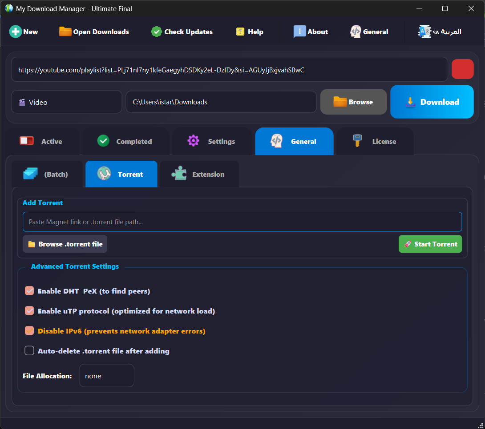
  <br>
  <em>الشكل 18: إعدادات التورنت - تحميل عبر التورنت</em>
</div>

**شرح إعدادات التورنت (الصورة رقم 18):**

- **حقل الرابط:** https://youtube.com/playlist?list=...
- **زر Add Torrent:** لإضافة رابط مغناطيسي أو ملف .torrent
- **إعدادات التورنت (Torrent Settings):**
  - تمكين DHT PeX (للبحث عن الأقران)
  - تمكين بروتوكول uTP (محسن لحمل الشبكة)
  - تعطيل IPv6 (لمنع أخطاء محول الشبكة)
  - حذف ملف .torrent تلقائياً بعد الإضافة
- **تخصيص الملفات (File Allocation):** none

---

### 🌐 إضافة المتصفح

<div align="center">
  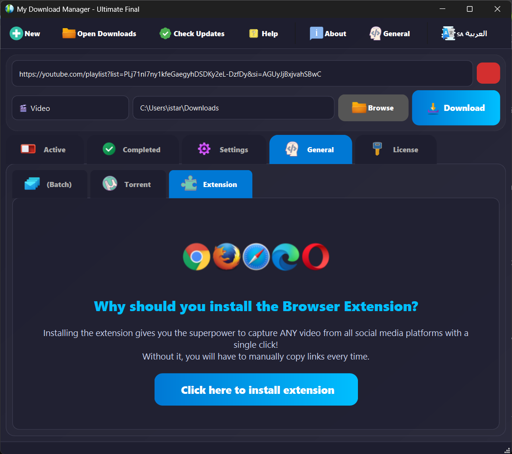
  <br>
  <em>الشكل 19: إضافة المتصفح - التقاط سحري بنقرة واحدة</em>
</div>

**شرح إضافة المتصفح (الصورة رقم 19):**

- **رسالة ترويجية:** "لماذا يجب عليك تثبيت إضافة المتصفح؟"
- **المزايا:** 
  - التقاط أي فيديو من جميع منصات التواصل الاجتماعي بنقرة واحدة
  - بدون الإضافة، ستحتاج إلى نسخ الروابط يدوياً في كل مرة
- **زر التثبيت:** "Click here to install extension"

---

### 🔑 إدارة الترخيص

<div align="center">
  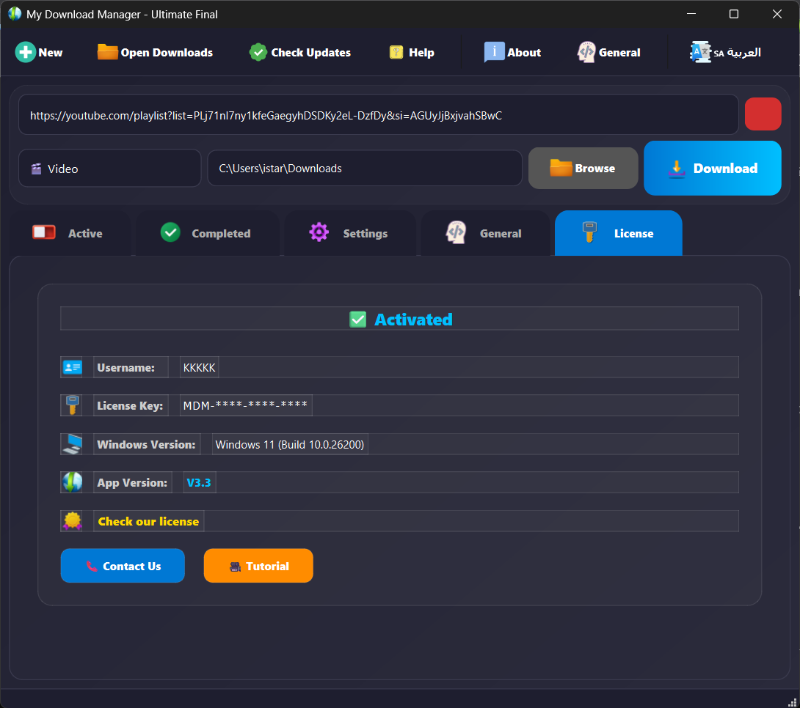
  <br>
  <em>الشكل 20: إدارة الترخيص والمعلومات</em>
</div>

**شرح إدارة الترخيص (الصورة رقم 20):**

- **اسم المستخدم:** KKKKK
- **مفتاح الترخيص:** MDM-****-****-****
- **معلومات النظام:**
  - إصدار ويندوز: Windows 11 (Build 10.0.26200)
  - إصدار التطبيق: V3.3
- **أزرار:** (Check our license - Contact Us - Tutorial)

---

### 🧩 إضافة المتصفح للمستخدمين

<div align="center">
  
  <br>
  <em>الشكل 21: إضافة المتصفح - معلومات مهمة</em>
</div>

**شرح إضافة المتصفح (الصورة رقم 21):**

- **اسم الإضافة:** My Download Manager
- **المطور:** Kamel Ahmed
- **التقييم:** ★★★★★
- **الإصدار:** 2.1.1
- **تاريخ التحديث:** 2026 يونيو
- **اللغات:** 1 لغة
- **ملاحظة مهمة:** هذه الإضافة هي أداة مساعدة وتتطلب تثبيت برنامج سطح المكتب (My Download Manager) على جهاز ويندوز لاعتراض وتسريع التحميلات. الإضافة لا تعمل بشكل مستقل بدون برنامج سطح المكتب.

---

## 🎯 How to Use | كيفية الاستخدام

### 🚀 دليل البدء السريع

1. **انسخ** رابط التحميل (فيديو أو ملف)
2. **الصق** الرابط في حقل URL في MDM
3. **اختر** نوع التحميل (ملف/فيديو)
4. **حدد** مجلد الحفظ
5. **اضغط** على "Download"
6. **اضبط** الخيارات في نافذة المعلومات
7. **ابدأ** التحميل!

### 🎮 ميزات المستخدم المحترف

#### المجلدات الذكية
```
Downloads/
├── Videos/
│   ├── YouTube/
│   │   ├── اسم القناة/
│   │   └── اسم قائمة التشغيل/
│   ├── TikTok/
│   └── Instagram/
├── Audio/
├── Documents/
└── Programs/
```

#### التحكم بالسرعة
- **حد عام:** تحديد سرعة التحميل الإجمالية
- **حد لكل تحميل:** تحديد سرعة فردية لكل تحميل
- **حصة النطاق الترددي:** تحديد حدود يومية/أسبوعية

#### إجراءات ما بعد التحميل
- 🔌 **إيقاف تشغيل الكمبيوتر**
- 💤 **وضع السكون**
- 🔄 **الإسبات**
- 📜 **سكربت مخصص**
- ⏰ **إجراءات مؤجلة** (0-120 دقيقة)

---

## 📱 تحميل من وسائل التواصل الاجتماعي

### 🎬 تحميل من يوتيوب
1. افتح الفيديو على يوتيوب
2. اضغط على زر "مشاركة"
3. اختر "نسخ الرابط"
4. الصق الرابط في MDM
5. اختر الجودة المفضلة (حتى 4K)
6. ابدأ التحميل!

### 📱 تحميل من تيك توك
1. افتح الفيديو على تيك توك
2. اضغط على زر "مشاركة"
3. اختر "نسخ الرابط"
4. الصق الرابط في MDM
5. اختر الجودة المفضلة
6. ابدأ التحميل!

### 📸 تحميل من إنستجرام
1. افتح المنشور على إنستجرام
2. اضغط على النقاط الثلاث
3. اختر "نسخ الرابط"
4. الصق الرابط في MDM
5. اختر نوع التحميل (فيديو/صورة)
6. ابدأ التحميل!

### 👍 تحميل من فيسبوك
1. افتح المنشور على فيسبوك
2. اضغط على النقاط الثلاث
3. اختر "نسخ الرابط"
4. الصق الرابط في MDM
5. ابدأ التحميل!

---

## 💡 Pro Tips | نصائح احترافية

### 🎬 تحميل الفيديوهات
- **يوتيوب:** استخدم "مشاركة → نسخ الرابط" للحصول على أفضل النتائج
- **تيك توك:** استخدم دائماً رابط المشاركة
- **إنستجرام:** انسخ الرابط من المنشور
- **فيسبوك:** استخدم رابط المشاركة

### 🔐 سلامة الملفات
- فعّل التحقق من التجزئة في الإعدادات
- يستخدم MDM SHA-256 للتحقق
- يتحقق تلقائياً من التحميلات

### 💼 الوضع المحمول
- أنشئ ملف `portable.ini` في مجلد التطبيق
- تحفظ الإعدادات في `settings.ini`
- لا حاجة لتغييرات في السجل

### 🌍 إعدادات البروكسي
- دعم HTTP، SOCKS4، SOCKS5
- مصادقة اسم المستخدم/كلمة المرور
- تطبيق على جميع التحميلات

---

## 🛠️ Troubleshooting | حل المشكلات

| المشكلة | الحل |
|-------|----------|
| **التحميل لا يبدأ** | تحقق من اتصال الإنترنت وجدار الحماية |
| **فشل تحميل 4K** | ثبّت ffmpeg (موجود مع MDM) |
| **الإضافة لا تعمل** | تأكد من تشغيل MDM وأن المنفذ 8765 مفتوح |
| **بطء التحميل** | تحقق من حدود السرعة وحصة النطاق الترددي |
| **خطأ في سلامة الملف** | أعد تحميل الملف |

---

## 📱 Connect With Us | تواصل معنا

<div align="center">

### 📲 **تابعنا للتحديثات والدعم**

[](https://www.facebook.com/profile.php?id=61562014983841)
[](https://youtube.com/@kamel_ahmed)
[](https://paypal.me/kamelahmed306)
[](https://github.com/kezoooop)
[](https://x.com/the_starkk)
[](https://linkedin.com/in/kamel-ahmed-a844352aa)
[](https://kamelahmed.netlify.app)

</div>

---

## 👨‍💻 About the Developer | عن المطور

<div align="center">

### **Kamel Ahmed**
#### *Software Engineer & Developer | Code Security Analyst | Vulnerability Expert*

</div>

- 🎓 درس في الأكاديمية البريطانية لعلوم الكمبيوتر، لندن
- 🛡️ أول برنامج أمني عربي بأكثر من 10M تحميلات
- ✍️ محرر تقني أول في منصة Xdev العالمية
- 📚 رئيس ومحاضر في برنامج مصر الرقمية
- 💻 خبير في: تحليل الكود، أمن التطبيقات، التصميم ثلاثي الأبعاد

---

<div align="center">

### ❤️ **Support the Developer | ادعم المطور** ❤️

[](https://paypal.me/kamelahmed306)

---

**© 2026 My Download Manager - Ultimate Final Edition. All rights reserved.**
**© 2026 مدير التحميلات المتقدم - الإصدار النهائي المطور. جميع الحقوق محفوظة.**

*Made with ❤️ by [Kamel Ahmed](https://kamelahmed.netlify.app)*
*تم الإنتاج بحب ❤️ بواسطة [كامل أحمد](https://kamelahmed.netlify.app)*

</div>

---

## 🎯 SEO Keywords | كلمات البحث

### English Keywords
- Download Manager
- Video Downloader
- YouTube Downloader
- TikTok Downloader
- Instagram Downloader
- Facebook Video Downloader
- 4K Video Downloader
- Playlist Downloader
- Accelerated Download
- Fast Download Manager
- Social Media Downloader
- Best Download Manager for Windows

### Arabic Keywords | الكلمات المفتاحية بالعربية
- مدير التحميلات
- تحميل فيديوهات
- تحميل من يوتيوب
- تحميل من تيك توك
- تحميل من انستجرام
- تحميل من فيسبوك
- تحميل فيديوهات 4K
- تحميل قوائم تشغيل
- مسرع تحميل
- أفضل مدير تحميل
- تحميل من السوشيال ميديا

---

## 📊 Quick Reference Guide | دليل سريع

| الإجراء | الاختصار |
|--------|----------|
| لصق الرابط | Ctrl + V |
| بدء التحميل | Enter |
| فتح مجلد التحميلات | Ctrl + O |
| فتح مدير الطابور | Ctrl + Q |
| حفظ الإعدادات | Ctrl + S |
| فتح المساعدة | F1 |

---

## 📈 Statistics | إحصائيات

<div align="center">

| المقياس | القيمة |
|--------|-------|
| إجمالي التحميلات | 10,000,000+ |
| المواقع المدعومة | 50+ |
| أنواع الملفات | جميع |
| السرعة القصوى | أسرع بـ 8 مرات |
| اللغات | 2 (عربي/إنجليزي) |

</div>

---

<div align="center">

### 🚀 **Start Downloading Faster Today!** 🚀
### 🚀 **ابدأ التحميل بشكل أسرع اليوم!** 🚀

[](https://github.com/kezoooop/MyDownloadManager/releases)

</div>

---

## 📝 ملخص الصور | Image Summary

| الصورة | المحتوى |
|--------|---------|
| **1** | الواجهة الرئيسية - مركز التحكم |
| **2** | نافذة معلومات التحميل - الإعدادات المتقدمة |
| **3** | قائمة التصنيفات - تنظيم الملفات |
| **4** | نافذة التحميل النشط - متابعة التقدم |
| **5** | إعدادات إيقاف التشغيل التلقائي |
| **6** | حالة التحميل المتوقف مؤقتاً |
| **7** | إعدادات البرنامج المتقدمة |
| **8** | إعدادات جودة التحميل |
| **9** | نافذة معلومات التحميل بالعربية |
| **10** | قائمة التحميلات المكتملة |
| **11** | مدير الطابور المتقدم |
| **12** | إعدادات التحميل المتقدمة |
| **13** | إعدادات البروكسي |
| **14** | إعدادات الإشعارات والطاقة |
| **15** | إعدادات الفيديو المتقدمة |
| **17** | استيراد قوائم التشغيل |
| **18** | إعدادات التورنت |
| **19** | إضافة المتصفح - التقاط سحري |
| **20** | إدارة الترخيص والمعلومات |
| **21** | إضافة المتصفح للمستخدمين |

---

**ملاحظة:** الصورة رقم 16 غير موجودة، وتتعلق بتحميل قوائم التشغيل (Playlist) كاملة عن طريق نسخ الرابط، وهو ما تم شرحه في الصورة رقم 17.
